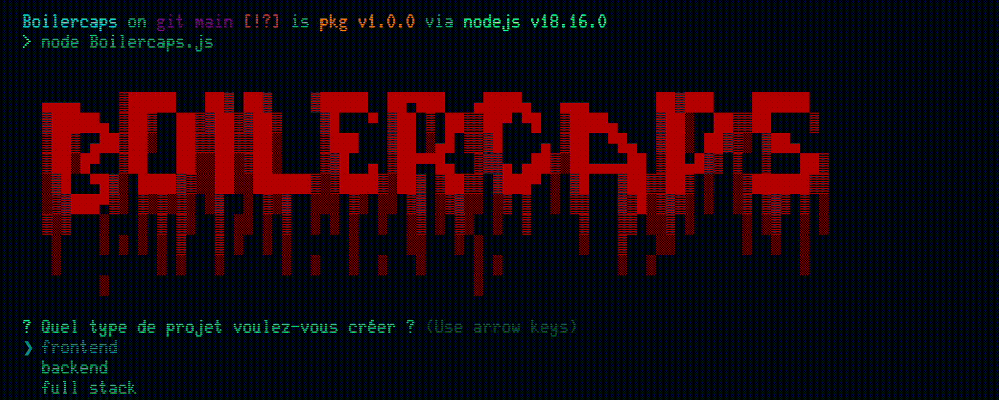
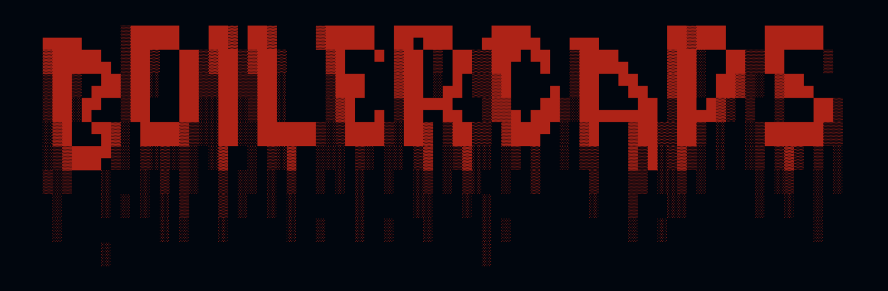

# Boilercaps

Boilercaps is a project generation tool that helps you quickly create frontend and backend applications using JavaScript and Node.js.



## 🚀 Installation

```bash
npm install -g boilercaps
```

## 🕹️ Usage

To create a new project, navigate to the root directory of your project (which should be empty), and then use the following command:

```bash
boilercaps
```

This command will initiate the project generation process and provide you with instructions to follow.
Make sure you are in the desired directory where you want to create your project before running the boilercaps command.

You can choose from multiple project types:

- Frontend (React, React Native, Expo, Next.js)
- Backend (Express with various optional dependencies)
- Full Stack (Combined frontend and backend)

## 🔧 Features

- Automatic project creation using the tool of your choice (create-react-app, create-next-app, etc.)
- Installation of common dependencies with a single command
- Full customization of installed dependencies
- Automatic generation of certain configuration files (.env, vercel.json, MongoDB connection)

## 💡 Contribution

Feel free to contribute to this project by opening Issues and proposing Pull Requests.

## 📝 License

MIT License. See [LICENSE](./LICENSE.txt) for more details.

© 2023 CodeSacha - Sacha Bigou


